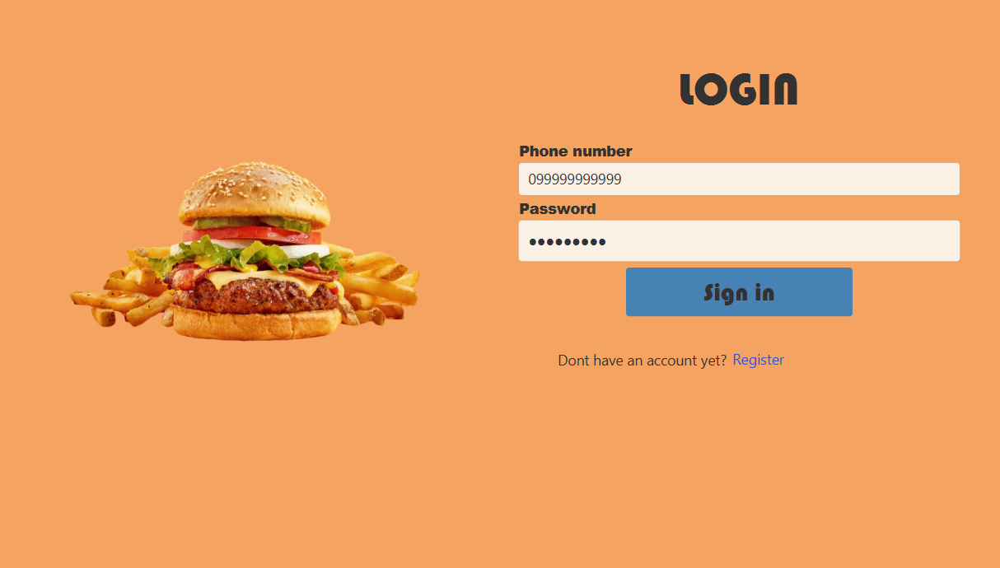
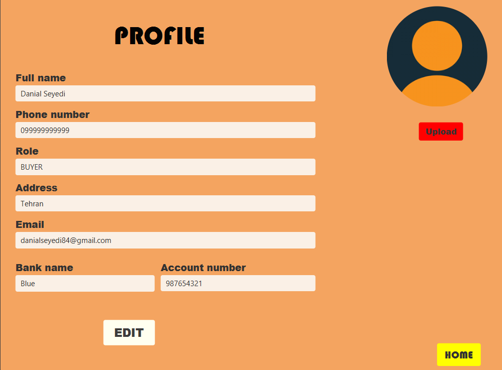
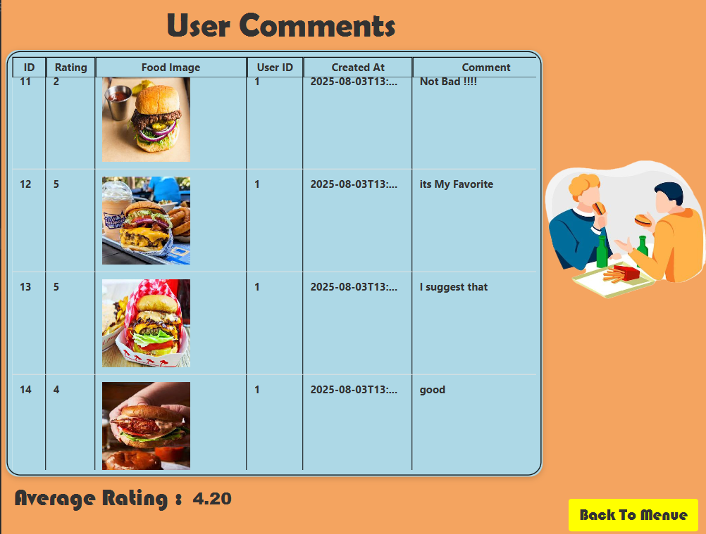
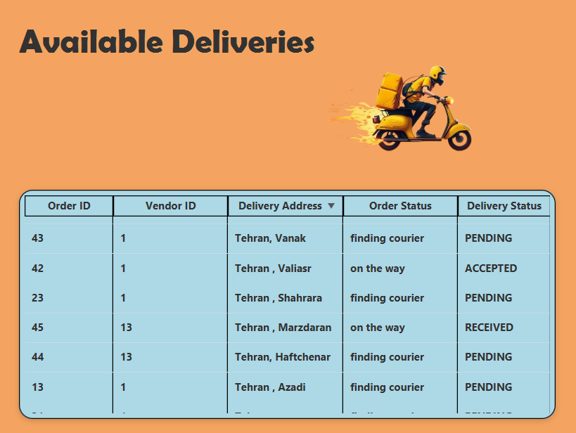
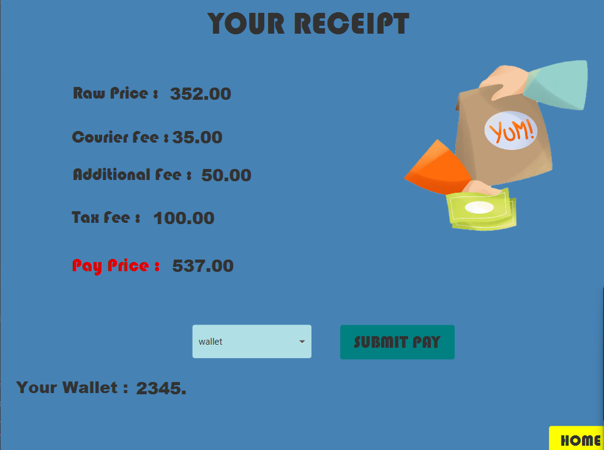
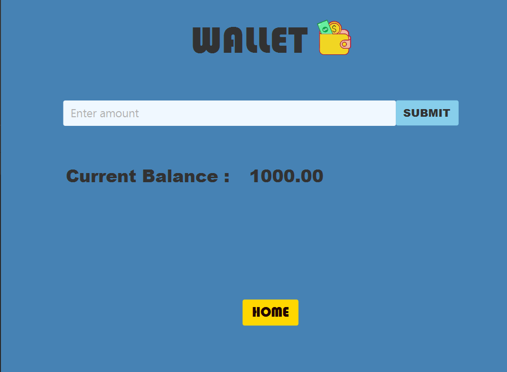

# 🍽️ SnappFood – Online Food Ordering Platform

A full-stack, multi-role online food ordering system developed as a team project for the Advanced Programming course – Spring 2025 (AUT).  
It allows customers, restaurant owners, delivery agents, and admins to interact through a real-world simulation of an online food delivery platform.

---

## 👨‍🏫 Course Details
- **Course**: Advanced Programming – Spring 2025
- **University**: Amirkabir University of Technology (AUT)
- **Instructors**: Dr. Amir Kalbasi & Dr. Hossein Zeinali

## 👨‍💻 Developers
| Name            | Student ID   |
|-----------------|--------------|
| Danial Seyedi   | 40331022     |
| Alireza Sarabi  | 40331021     |

> ✅ This project was developed collaboratively by both members. All frontend and backend components were designed and implemented as a team.

---

## 🚀 Features
- ✅ User registration & authentication
- 🧑 Multiple user roles: Customer, Restaurant, Delivery, Admin
- 🛒 Cart & ordering system
- 🍽️ Menu and restaurant management
- 💳 Online payment and internal wallet
- 🔔 Order tracking with notifications
- ⭐ Ratings, comments, and image upload
- 📊 Admin dashboard and analytics
- 🎯 Filtering, searching, and suggestions

---

## 🧱 Technologies Used

| Frontend                          | Backend            | Storage    | Tools |
|----------------------------------|--------------------|------------|-------|
| JavaFX (FXML)                    | Java OOP           | JSON files | Gson  |
| Java 17                          | RESTful API (HTTP) |            |       |
| Package: `org.example.snappfrontend` | Package: `server`     |            |       |

---

## 📁 Project Structure

```
SnappFood/
├── Client/
│   └── src/main/java/org/example/snappfrontend/...
│   └── src/main/resources/org/example/snappfrontend/...
├── Server/
│   └── src/...
└── screenshots/
    ├── screenshot1.png
    ├── ...
    └── screenshot7.png
```

---

## 🖼️ Screenshots

(Place your screenshots in a folder named `screenshots` next to your `README.md`)

  
  
  
  
  
  
  

---

## ⚙️ How to Run

### ✅ Prerequisites
- Java 17+
- Maven (optional, if used)

### ▶️ Run Backend
```bash
cd Server/
# Compile & run your Java backend code
```

### ▶️ Run Frontend
```bash
cd Client/
# Launch JavaFX app using IDE (e.g., IntelliJ or Eclipse)
```

> Make sure backend is running before launching the frontend.

---

## 📝 Notes
- Backend is structured around RESTful APIs using standard HTTP verbs: `GET`, `POST`, `PUT`, `DELETE`.
- Data is stored in local `.json` files with periodic autosave every few minutes.
- Frontend UI is built with JavaFX using FXML and SceneBuilder.
- You may need to adjust relative paths depending on how you run the project.

---

## 📃 License

This project was developed for educational purposes only under the guidelines of the AP Course – AUT 2025.

---

## 📌 Tips for GitHub Upload
1. Place all screenshots in `screenshots/` folder.
2. Keep `README.md` in the root of your repository.
3. Upload entire project including both `Client/` and `Server/`.

```
📦 SnappFood/
├── Client/
├── Server/
├── screenshots/
└── README.md
```
