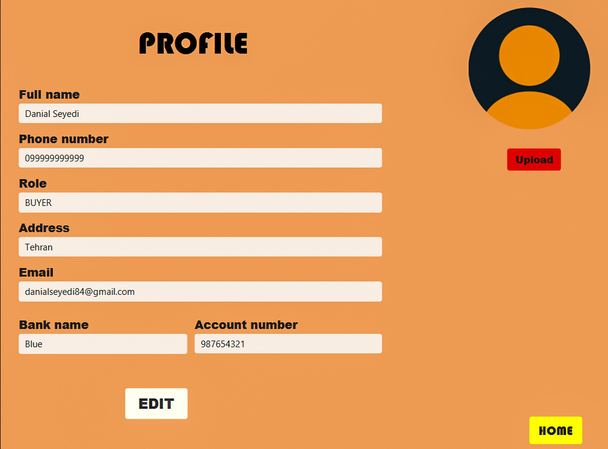
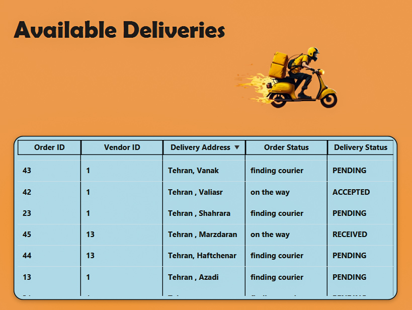
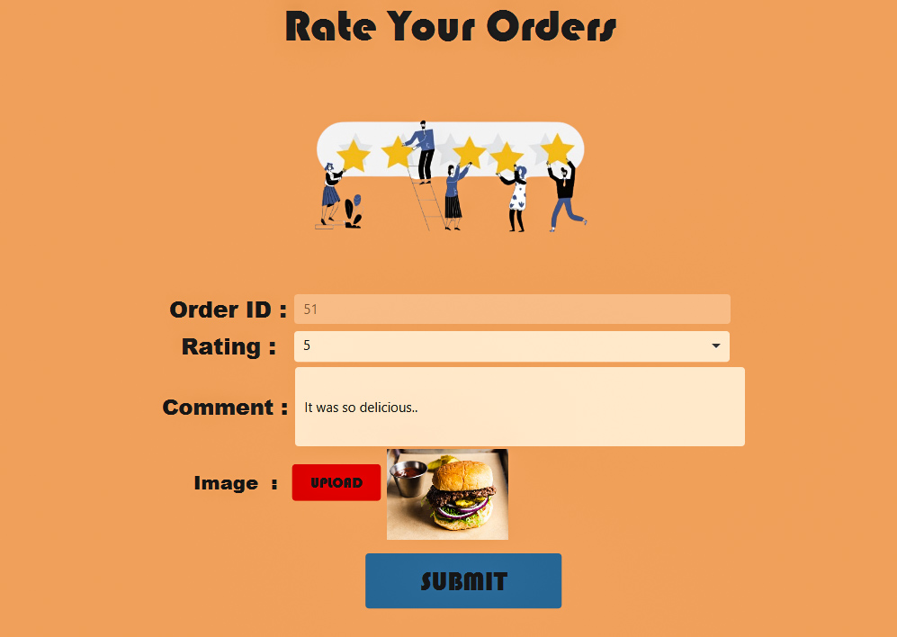

# 🍽️ SnappFood – Multi-Role Online Food Ordering Platform

Welcome to **SnappFood**, a full-featured, multi-role food ordering system developed as a final project for the *Advanced Programming* course at Amirkabir University of Technology (AUT).  
This Java-based application emulates real-world online food delivery operations through an intuitive JavaFX interface and a well-structured backend. It supports various user roles — Customers, Restaurants, Delivery Agents, and Admins — each with a tailored experience.

> 🍔 Hungry to code? Whether you're placing an order, managing a kitchen, or delivering meals, **SnappFood** is built to serve.

---

## 🧑‍🏫 Course Details

- **Course Title**: Advanced Programming – Spring 2025  
- **Institution**: Amirkabir University of Technology (AUT)  
- **Instructors**: Dr. Amir Kalbasi, Dr. Hossein Zeinali  

---

## 👨‍💻 Development Team

Project developed collaboratively by:

- **Danial Seyedi**  
- **Alireza Sarabi**

Both developers contributed to the design and implementation of both frontend and backend components.

---

## ✨ Features at a Glance

- 🔐 Secure, role-based authentication and authorization  
- 👥 Multiple user roles: Customer, Restaurant, Delivery Agent, Admin  
- 🍽️ Restaurant and menu management with live updates  
- 🛒 Interactive cart system with product filtering and search  
- 💰 Online payments & internal wallet integration  
- 📦 Real-time order tracking for customers and delivery agents  
- 🔔 Push notifications on order status changes  
- 🌟 Ratings, reviews, and image uploads for dishes  
- 📊 Admin dashboard with analytics and insights  

---

## 📁 Project Structure

### 🔹 Frontend (`Client/src/main/java/org/example/snappfrontend/`)

- `controllers/` – JavaFX controllers (UI logic)  
- `dto/` – Data transfer objects for API communication  
- `http/` – HTTP request handling utilities  
- `models/` – Core frontend data models  
- `utils/` – Constants and utility functions  
- `resources/pages/` – FXML layout files  
- `resources/images/` – Icons and UI assets  

### 🔹 Backend (`Server/src/...`)

- `controller/` – RESTful endpoints for handling requests  
- `model/` – Core backend data models  
- `dao/` – Data Access Objects for JSON-based persistence  
- `service/` – Business logic and service layer  
- `utils/` – Backend utility classes  
- `main/` – Application entry point  

---

## 🖼️ Screenshots

       

      

      

      

        

---

  ## 🧱 Tech Stack

| Layer        | Technologies Used                                |
|--------------|--------------------------------------------------|
| Frontend     | JavaFX (FXML), SceneBuilder, Java 17             |
| Backend      | Java OOP, RESTful APIs over HTTP/JSON            |
| Data Storage | Local JSON files with auto-save functionality    |
| Libraries    | Gson, JavaFX, Java HTTP Client                   |

---

## ⚙️ Getting Started

### ✅ Requirements

- Java 17 or higher  
- IDE (e.g., IntelliJ IDEA, Eclipse)  

### 🚀 Running the Backend

1. Open the `Server/` directory in your IDE  
2. Locate and run the `main` class  
3. The backend will start and listen for HTTP requests  

### 🖥️ Running the Frontend

1. Open the `Client/` directory in your IDE  
2. Run the main JavaFX application class  
3. The UI will automatically communicate with the backend via REST  

> ⚠️ Make sure the backend is up and running before launching the frontend.

---

